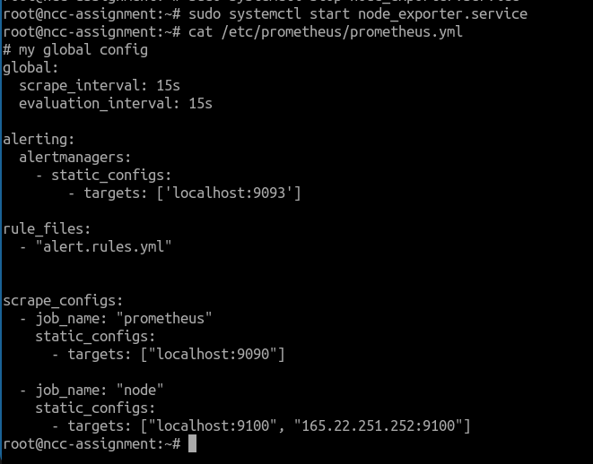
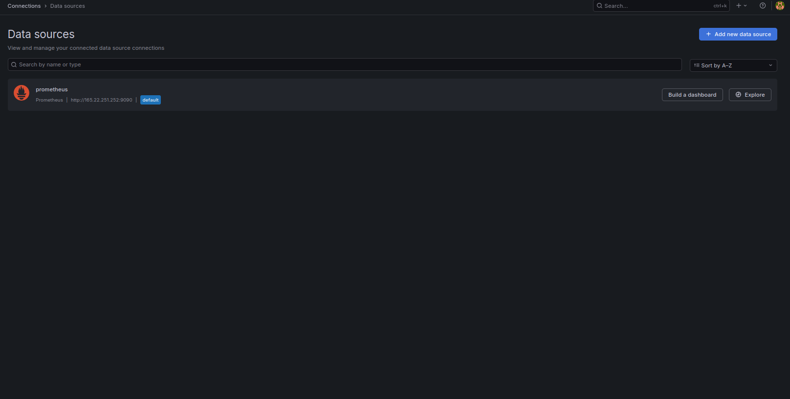
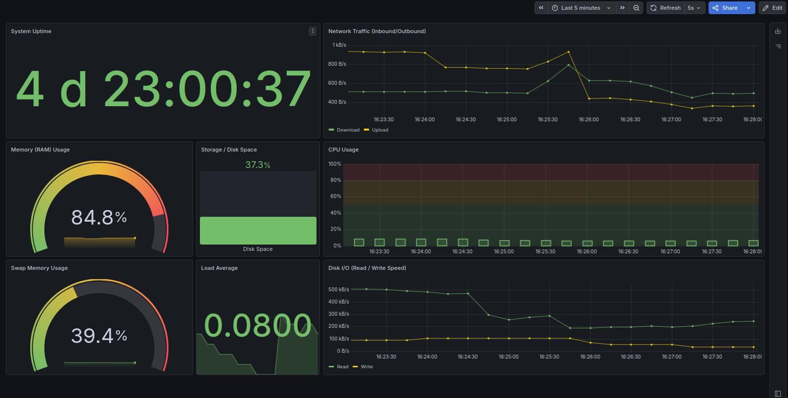
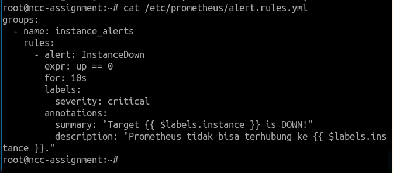
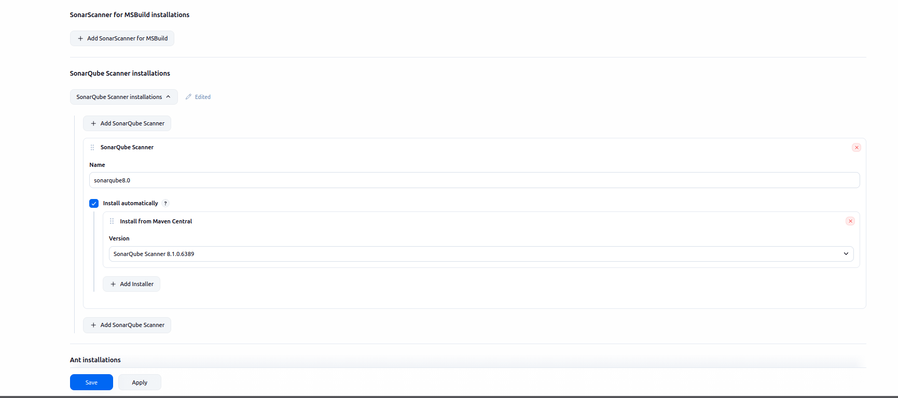

### url: http://165.22.251.252:3000/

---

## 1. Arsitektur Sistem Monitoring

Sistem ini dibangun menggunakan *stack* monitoring berbasis open-source yang dijalankan sebagai layanan sistem (*systemctl*) untuk memastikan stabilitas dan performa maksimal. Komponen utamanya adalah:

1.  **Node Exporter (Target):** Bertugas mengumpulkan metrik perangkat keras dan sistem operasi langsung dari kernel Linux (CPU, RAM, Disk, Network) dan mengeksposnya di port `9100`.
2.  **Prometheus:** Berfungsi sebagai *Time Series Database* (TSDB) yang melakukan *scraping* data dari target, menyimpan data historis, serta mengevaluasi aturan alert.
3.  **Alertmanager:** Bertugas mengelola notifikasi alert yang dikirim oleh Prometheus, melakukan grouping, dan meneruskannya ke kanal komunikasi pihak ketiga (Discord).
4.  **Grafana:** Berfungsi sebagai *front-end* visualisasi yang mengambil data dari Prometheus untuk dirender menjadi dashboard interaktif.

---

## 2. Integrasi Prometheus dengan Grafana

Integrasi dilakukan dengan menghubungkan Grafana ke Prometheus melalui protokol HTTP.

* **Endpoint:** Grafana mengakses API Prometheus pada URL `http://localhost:9090`.
* **Mekanisme:** Grafana mengirimkan *query* menggunakan bahasa **PromQL** (Prometheus Query Language). Prometheus memproses query tersebut terhadap database internalnya dan mengembalikan data dalam format JSON yang kemudian divisualisasikan oleh Grafana secara *real-time*.

---

## 3. Konfigurasi Sistem

### A. Konfigurasi Prometheus (`prometheus.yml`)

### B. Konfigurasi Data Source di Grafana

---

## 4. Visualisasi (Custom Dashboard)

Dashboard dirancang untuk memberikan informasi kesehatan server secara *real-time*. Metrik utama yang dipantau meliputi:
* **System Uptime:** Total waktu server telah berjalan.
* **CPU Usage:** Persentase beban kerja prosesor.
* **Memory (RAM) Usage:** Penggunaan memori fisik.
* **Storage / Disk Space:** Kapasitas penyimpanan pada partisi root.
* **Network Traffic:** Monitor bandwidth Inbound (Download) dan Outbound (Upload).
* **Swap Memory Usage** Monitoring penggunaan memory swap.
* **Load Average:** Monitoring average load.
* **Disk I/O (Read & Write):**Monitoring perpindahan data antara media penyimpanan fisik dan sistem komputer**.

---

## 5. Alur Monitoring & Alerting

Alur kerja data dan notifikasi dalam sistem ini adalah sebagai berikut:

1.  **Metrics Collection:** Node Exporter mengambil metrik mentah sistem.
2.  **Scraping:** Prometheus menarik metrik tersebut setiap 5 detik (berdasarkan konfigurasi `scrape_interval`).
3.  **Visualization:** Grafana menampilkan data tersebut melalui query PromQL.
4.  **Alerting Logic:**
    * Prometheus mengevaluasi aturan alert (misal: `up == 0`).
    * Jika kondisi terpenuhi selama durasi `for: 10s`, Prometheus mengirimkan alert ke **Alertmanager**.
5.  **Notification:** Alertmanager memproses alert tersebut dan mengirimkan notifikasi ke **Discord Webhook** secara instan.

---

## 6. Kendala yang Dihadapi

1.  **Port Conflict:** Terjadi bentrok port 3000 antara service awal dan Grafana sehingga grafana sekarang menggunakan port 5555
3.  **Prometheus to Alertmanager Connection:** Alert sudah Firing di Prometheus namun tidak muncul di Discord. Solusi: Memperbaiki target `alerting` di `prometheus.yml` ke `localhost:9093` dan memastikan durasi `group_wait` diperpendek untuk pengujian.

