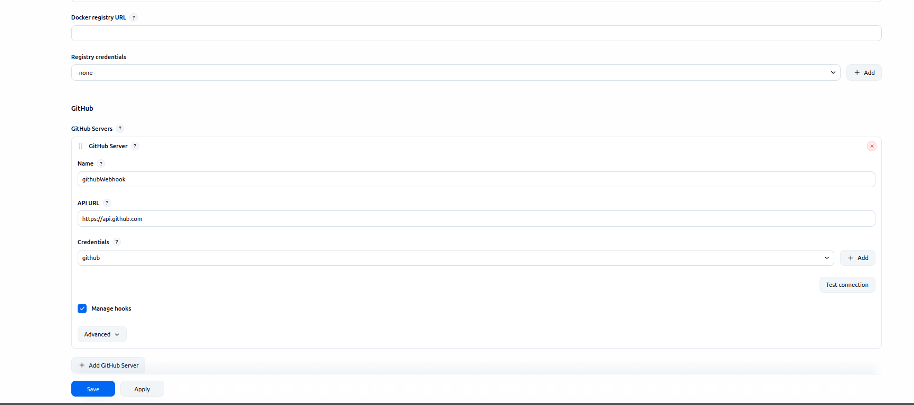
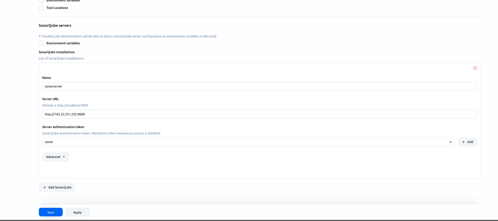
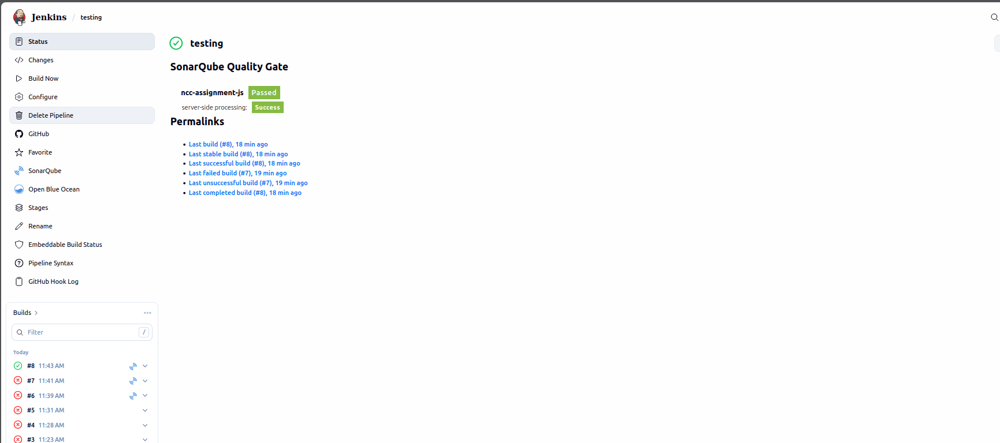
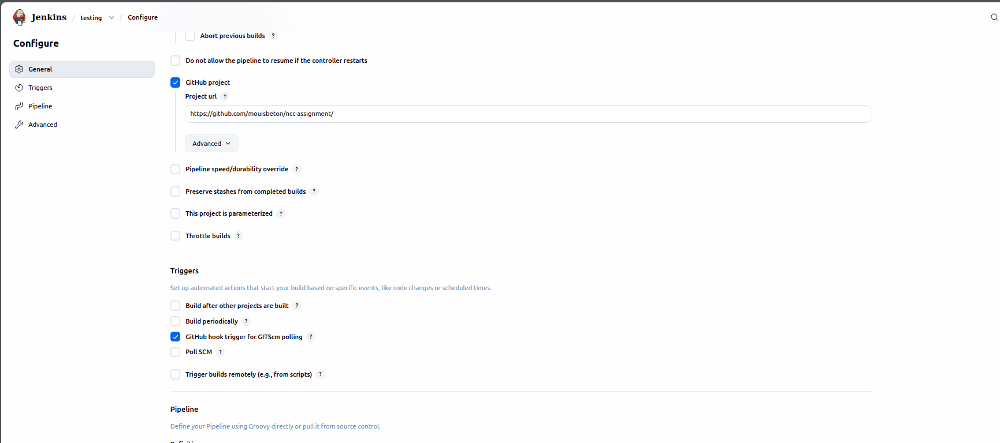
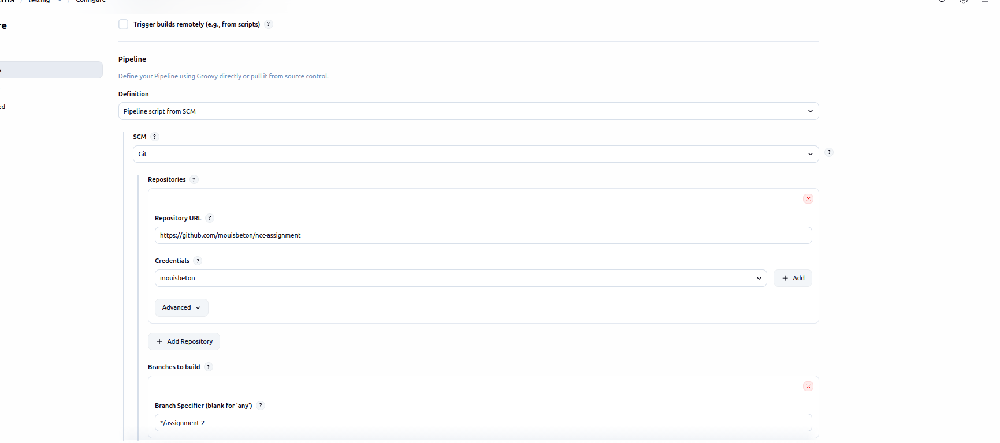
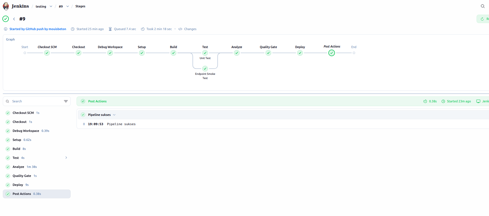

### url: http://165.22.251.252:3000/

---

## Deskripsi Pipeline

Pipeline menggunakan Jenkinsfile dan dibagi menjadi beberapa stage terstruktur.

1. Checkout
   - Mengambil source code dari repository.
2. Install
   - Instalasi dependensi menggunakan npm ci.
   - Cache sederhana node_modules untuk mempercepat build berikutnya.
3. Build
   - Menjalankan build jika diperlukan (sesuai skrip di package.json).
4. Test
   - Menjalankan unit test (jika tersedia) dan menghasilkan laporan.
5. Analyze (SonarQube)
   - Mengirim hasil analisis ke SonarQube melalui scanner.
6. Quality Gate
   - Pipeline gagal otomatis jika Quality Gate tidak terpenuhi.

## Penjelasan Integrasi Jenkins dan SonarQube

Integrasi dilakukan dengan langkah berikut:

1. Install plugin SonarQube Scanner di Jenkins.
2. Konfigurasi SonarQube Server di Jenkins (Manage Jenkins > Configure System).
3. Menambahkan credential token SonarQube di Jenkins (Manage Jenkins > Credentials).
4. Mendefinisikan environment variable di Jenkinsfile untuk host dan token.
5. Menjalankan tahap analyze dengan SonarQube Scanner dan menunggu hasil Quality Gate.

## Alur Pipeline (Flow)

Flow pipeline berjalan dari build hingga analisis kualitas sebagai berikut:

Checkout -> Install -> Build -> Test -> Analyze (SonarQube) -> Quality Gate -> Done

Jika Quality Gate gagal, pipeline berhenti dan status build menjadi failed.

## Screenshot Konfigurasi

## Webhook dan Trigger Otomatis

Webhook diatur pada repository untuk mengirim event push ke Jenkins. Jenkins menerima webhook dan menjalankan pipeline otomatis tanpa harus manual build.

## Badge atau Status Build

Badge build diaktifkan dari Jenkins dan ditampilkan pada README atau repository untuk menunjukkan status build terkini.

## Optimasi Pipeline

- Cache node_modules untuk mempercepat build berikutnya.
- Stage test dan lint dapat dijalankan paralel bila skrip mendukung.

## Kendala (Jika Ada)

- VPS kena hack :sob: terpaksa harus rebuild ulang dan reconfig jenkins & sonarqube

