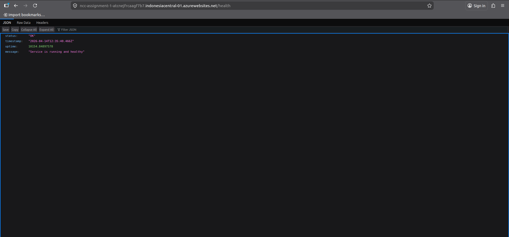

# NCC Assignment

URL Service: https://ncc-assignment-1-atcnejfrcaagf7b7.indonesiacentral-01.azurewebsites.net

## Deskripsi Singkat Service

Service yang dibuat adalah sebuah aplikasi berbasis Node.js yang berfungsi menyediakan layanan web sederhana dengan beberapa endpoint dasar. Aplikasi ini dirancang agar siap dideploy menggunakan Docker container.

## Penjelasan Endpoint /health

Endpoint `/health` digunakan sebagai jalur untuk melakukan *health check*. Saat endpoint ini diakses, service akan mengembalikan respons yang menunjukkan status bahwa aplikasi saat ini berjalan aktif dan sehat. Hal ini berguna bagi layanan monitoring atau load balancer untuk memastikan ketersediaan sistem.

## Penjelasan Kode Endpoint

Aplikasi ini dibangun menggunakan framework Express.js dan memiliki beberapa endpoint dasar:
- `GET /` : Endpoint root yang mengembalikan pesan selamat datang (Welcome) beserta direktori rute yang tersedia.
- `GET /health` : Endpoint utama untuk pengecekan kesehatan mesin. Kode memanggil fungsi `process.uptime()` pada Node.js untuk mengirimkan data spesifik seberapa lama aplikasi sudah aktif (uptime) dan menyertakan indikator status `OK`.

Selain itu, bagian server (`server.js`) sudah mendukung *Graceful Shutdown* (menangani sinyal `SIGTERM` dan `SIGINT`), yang membuat aplikasi dapat dimatikan dengan aman dengan menyelesaikan semua proses HTTP terlebih dahulu sebelum sepenuhnya exit.

## Screenshot Bukti Endpoint Dapat Diakses



## Penjelasan Build File (Dockerfile)

Aplikasi ini menggunakan fitur *Multi-Stage Build* Docker, yang dibagi ke dalam 2 tahapan:

1. **Stage 1 (Builder):** Menggunakan basis OS yang ringan `node:18-alpine` untuk memuat file dependensi (`package.json`). Dilakukan instalasi khusus modul untuk tingkat produksi saja menggunakan command `npm ci --omit=dev`, lalu menghapus memori *cache npm* secara otomatis agar image nantinya lebih kecil.
2. **Stage 2 (Runtime):** Mengambil (copy) folder modul (`node_modules`) yang telah terpasang dari step builder, serta source code (`src/`) utama dari server. Tiga aspek utama tahap ini adalah:
   - **Expose Port 3000** : Agar sistem mengetahui dan membuka port internal dari container Docker yang digunakan Node.js.
   - **Healthcheck Internal** : Menyertakan instruksi `HEALTHCHECK` otomatis dari Docker (Setiap 30 detik) yang meniru *request* HTTP (curl/node -e internal) langsung kepada endpoint layanan lokal `/health`. Jika server nonaktif (respons gagal / *timeout*), docker dapat mengirim alert.
   - **Perintah Eksekusi Server** : Instruksi final di penutup memakai `CMD ["node", "server.js"]` yang mengaktifkan service utama aplikasi ini.

## Penjelasan Proses Build dan Run Docker

Proses containerization (membuat image Docker) dan menjalankannya membutuhkan langkah-langkah berikut:

1. Mengemas file project dan dependensi menjadi image menggunakan perintah:
   ```bash
   docker build -t mouis/ncc-assignment:latest .
   ```
2. Menjalankan image tersebut menjadi container aktif di lokal:
   ```bash
   docker run -d -p 8080:8080 mouis/ncc-assignment:latest
   ```

## Penjelasan Proses Deployment ke Azure App Service

Deployment dilakukan dengan menyiapkan image di registri Docker Hub lalu mengintegrasikannya dengan Azure Web Apps. Berikut urutannya:

1. Melakukan push image dari komputer lokal ke repositori di Docker Hub:
   ```bash
   docker push mouis/ncc-assignment:latest
   ```
2. Membuka Azure Portal dan membuat resource "Web App" baru.
3. Pada pemilihan konfigurasi "Publish", digunakan opsi "Docker Container" (OS: Linux).
4. Pada tab "Docker", bagian Image Source diatur ke "Docker Hub".
5. Image name and tag disesuaikan dengan nama image yang sebelumnya di-push (contoh: `mouis/ncc-assignment:latest`).
6. Setelah Web App berhasil dibuat, platform Azure akan secara otomatis mengunduh (pull) image tersebut dari Docker Hub lalu menjalankannya ke server Azure App Service.

